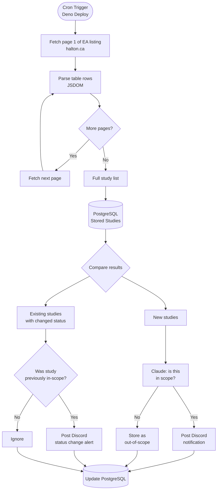

# Municipal Environmental Assessment Scraper

## 🚨 The Problem
Municipal class environmental assessments (EAs) are significant for Safe Streets Halton for two reasons: proposed road changes within an EA can directly impact pedestrian and cyclist safety, and EAs include public consultation windows with strict deadlines — missing the start of a study means missing the opportunity to participate.

Currently, Safe Streets Halton has no way of being notified when a new EA begins. This is checked manually and infrequently through each municipality's website, which risks missing new studies entirely or catching them too late to engage.

## 💡 Proposal
A job that runs regularly to scrape each municipality's EA listing pages, compare results to a stored snapshot, and post a Discord notification when new studies are detected.

## 🗺️ Municipalities Covered

Each municipality exposes EA information differently, which means the scraper requires a custom adapter per source.

| Municipality | EA Listing Page | Structure | Status Field | Notes |
|---|---|---|---|---|
| **Halton Region** | [EA Studies](https://www.halton.ca/for-residents/infrastructure-and-growth/municipal-class-environmental-assessment-studies) | Searchable table (Project, Municipality, Status) | Structured: `On-going`, `Deferred`, `Completed` | 5 pages of results; individual study pages linked |
| **City of Burlington** | [Get Involved Burlington](https://www.getinvolvedburlington.ca/projects) | EngagementHQ project tiles (single page) | No EA status (project `published`/`archived` state only) | City's own `/Modules/News/` EA index is WAF-blocked; the engagement platform is where active consultations are posted |
| **Town of Oakville** | [EA Studies](https://www.oakville.ca/transportation-roads/transportation-roads-studies-and-plans/environmental-assessment-studies/) | Simple list with title and 1–2 sentence description | No status on listing page | Must follow individual study links to determine status |
| **Town of Milton** | [Town Projects](https://www.milton.ca/en/business-and-development/town-projects.aspx) | No central EA listing; projects spread across individual pages | Embedded in project page text | Individual pages are rich (full timelines, public open house dates/locations, comment deadlines) |
| **Town of Halton Hills** | [EA Studies](https://www.haltonhills.ca/en/residents/environmental-assessment-ea-studies.aspx) | Structured listing with study details | Free-form text (e.g. "Study initiated April 2015, on-going") | Includes consultant names, contact info, and PIC dates |

## 🔍 Scraping Approach by Municipality

Each municipality requires a custom adapter. Approaches are documented below as they are implemented.

### Halton Region



- **Listing page:** Paginated searchable table at `/municipal-class-environmental-assessment-studies`
- **Pagination:** The table spans multiple pages (currently 5); the adapter iterates through all pages using the `page=` query parameter until no further results are returned
- **Parsed fields:** Project name, municipality, status (`On-going` / `Deferred` / `Completed`), and link to the individual study page
- **CSS selector:** Results are in `.hal-generic-smart-search-results-table tbody tr`; each row contains three `<td>` elements in order: project name (with anchor), municipality, status
- **Individual study pages:** Linked from the project name column; contain additional detail including study description and engagement information (see [Engagement Data Extraction](#engagement-data-extraction-planned))

### City of Burlington

Burlington does not publish a structured EA listing. The city's EA news index
(`burlington.ca/Modules/News/en/Environmental`, linked from the README's original table) is
served behind an Azure WAF rule that returns **403 on any `/Modules/` path** — individual
`.aspx` news pages load fine, but the module-rendered listing (and its RSS feed) cannot be
fetched, and the path rule applies to every client, so it would fail from Deno Deploy too.
The site's `sitemap.xml` does not enumerate the individual EA news posts either.

Instead, the adapter targets **Get Involved Burlington** (`getinvolvedburlington.ca`), the
city's Granicus **EngagementHQ** platform. This is where active EA public consultations and
their comment windows are posted — exactly the engagement data this project cares about.

- **Listing page:** Single, server-rendered page at `/projects`. Every project is a
  `.project-tile` with a `data-state` (`published` / `archived`), an `a.project-tile__link`
  to the project page, and a `.project-tile__meta__name` title.
- **Not EA-specific:** Unlike the other municipalities' listings, this platform carries
  *every* kind of engagement (budgets, festivals, surveys, …), not just EAs. The scope
  classifier filters out non-EA / out-of-scope projects the same way it does elsewhere —
  out-of-scope projects are stored but never trigger a notification. (Trade-off: EAs that
  only ever appear as a news notice, with no engagement project, are not covered.)
- **Title decoding:** Listing titles are double HTML-encoded in the source markup
  (`Festivals &amp;amp; Events Strategy`), so the adapter decodes entities a second time.
- **No status field:** There is no EA status, so `inferStatus: true` — Claude infers status
  during classification from the detail-page content. The project's `published`/`archived`
  state is recorded verbatim in `rawStatus`.
- **Individual project pages:** Description is taken from `.shared-content-block` content
  sections; documents are collected from the document-library widget
  (`a.document-library-widget-link`). These links carry no publication-date label, so
  document `date` is left null.

### Town of Oakville

- **Listing page:** Single, un-paginated page at `/transportation-roads/transportation-roads-studies-and-plans/environmental-assessment-studies/`
- **Parsed fields:** Project name and link to the individual study page. Oakville covers a single municipality, so `municipality_areas` is always `{Oakville}`
- **CSS selector:** Studies are rendered as cards under `.widget-page-cards a.card`; each card has a `.card-title` (study name) and `.card-text` (short description)
- **No status field:** Unlike Halton Region, Oakville's listing has no status column and the individual pages have no structured status either. Status is **inferred by Claude** during classification from the detail-page text and document titles (e.g. a "Notice of Study Completion" document implies the study is `completed`). The classifier is invoked with an `inferStatus` flag that adds a `status` field to its structured output; for sources like Halton that publish an authoritative status, this flag is left off.
- **Individual study pages:** Description is taken from `.widget-text` blocks; published reports/notices are collected from the `.widget-link-listing` ("Project documents") lists. These pages have no consistent publication-date labels, so document `published_label` is left null.

### Town of Milton *(TBD)*

Milton has no central EA listing page. Studies are discoverable only through the general Town Projects index. Discovery strategy to be determined.

### Town of Halton Hills *(TBD)*

Halton Hills has a structured listing with rich metadata (consultant, contact, PIC dates), but status is embedded in free-form prose. Approach to be determined.

---

## ⚙️ How It Works
1. A scheduled job runs a municipality-specific adapter for each of the five sources
2. Each adapter uses JSDOM to fetch and parse the EA listing page into a normalised list of studies with title, URL, and status where available
3. Results are compared against the studies stored in PostgreSQL
4. For each **new** study, Claude classifies whether it falls within Safe Streets Halton's scope — road, intersection, active transportation, or similar infrastructure — as opposed to out-of-scope work like water mains or utility projects
5. For each **existing** study, the scraper checks whether the status has changed since the last run
6. A Discord notification is sent for new in-scope studies, and for status changes on studies previously classified as in-scope
7. The database is updated to reflect the latest study list and statuses

> **Note on status accuracy:** Status fields are inconsistently structured across municipalities — Halton Region uses discrete values (`On-going`, `Deferred`, `Completed`), while others embed status in free-form text or omit it from the listing page entirely. The scraper records whatever is shown and tracks changes over time, but manual verification is recommended for any study where the status seems unexpectedly stale.

## 📅 Engagement Data Extraction

Where available, each EA study's individual page is scraped for:
- **Public consultation dates and times** — open houses, comment deadlines, or hearing dates
- **Engagement links** — registration pages, online comment forms, or document downloads

This information is unstructured and inconsistently formatted across municipalities. For example, Milton's individual study pages include full public open house schedules (date, time, location, comment deadline) and links to platforms like "Let's Talk Milton", while Halton Hills pages list PIC dates and consultant contacts. Burlington embeds timeline information in its Get Involved project lifecycle stages and content blocks with no consistent structure.

Because no two municipalities format this data the same way, extraction is handled by Claude Haiku using a forced tool call to produce structured output — the same pattern used for scope classification.

Extracted engagement data is stored in the `engagement_events` table and included in Discord notifications for upcoming events, so Safe Streets Halton members have everything they need to participate without leaving the alert. Past events and events belonging to completed studies are stored but do not trigger notifications.

## 🛠️ Tech Stack
- [Deno](https://deno.com/) + TypeScript
- [JSDOM](https://github.com/jsdom/jsdom) for HTML parsing
- [Claude](https://www.anthropic.com/claude) (Anthropic) for EA scope classification
- [Discord Webhooks](https://discord.com/developers/docs/resources/webhook) for notifications
- [Deno Deploy](https://deno.com/deploy) for hosting and scheduling
- [PostgreSQL](https://www.postgresql.org/) (via Deno Deploy) for snapshot persistence

## 🏗️ Infrastructure Design

This project was designed with a **zero-cost or near-zero-cost** deployment model in mind, while still being production-reliable.

| Concern | Choice | Reasoning |
|---|---|---|
| **Language & Runtime** | Deno + TypeScript | Native TypeScript support eliminates a build step; Deno's explicit permissions model (network, env, file access declared upfront) is a good fit for a scraper that should have a minimal and auditable attack surface; and the rich standard library reduces dependency overhead |
| **Hosting & Scheduling** | Deno Deploy | Pairs naturally with the Deno runtime; the free tier includes native cron triggers and serverless functions with no infrastructure to manage |
| **Snapshot Storage** | PostgreSQL on Deno Deploy | Persistent storage is required to diff new scrape results against previously seen studies; co-locating the database on Deno Deploy avoids a separate managed service |
| **HTML Parsing** | JSDOM | The target pages are server-rendered HTML, so a full headless browser (Playwright/Puppeteer) is unnecessary overhead — JSDOM is lighter, faster, and better supported in the Deno ecosystem |
| **EA Classification** | Claude (Anthropic) | Municipal EA listings often provide only a title and brief description, with no structured category field. A language model can reliably infer whether a study involves road, intersection, or active transportation infrastructure — the types relevant to Safe Streets Halton — versus unrelated work like water mains or utilities. Claude Haiku makes this cost-effective at scale. |
| **Notifications** | Discord Webhook | Free and instant with no email server or mailing service required — a single webhook URL is all that's needed to post alerts to a channel |

This stack keeps operational costs at $0 while providing persistent state, reliable scheduling, and real-time alerts — a practical pattern for civic-tech tools that need to run indefinitely without active maintenance.

## 🚀 Setup

**Prerequisites:** [Deno](https://deno.com/) and [varlock](https://varlock.dev/getting-started/installation/) installed

```bash
git clone <repo-url>
cd EAStudyParser
```

Set the required environment variables:

```bash
export DISCORD_WEBHOOK_URL=https://discord.com/api/webhooks/...
export DATABASE_URL=postgresql://...
export DATABASE_CERT="-----BEGIN CERTIFICATE-----..."
export ANTHROPIC_API_KEY=sk-ant-...
```

Run the scraper locally:

```bash
deno task dev
```

## ☁️ Deployment

Deploy to [Deno Deploy](https://deno.com/deploy) and configure the above environment variables in the project settings. Use Deno Deploy's built-in cron trigger to run the scraper on a schedule (e.g. daily at 8am UTC).
